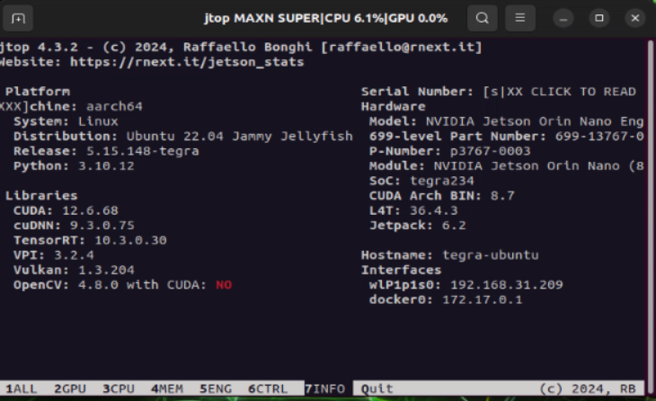
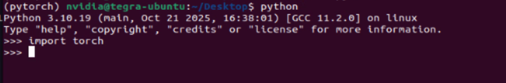
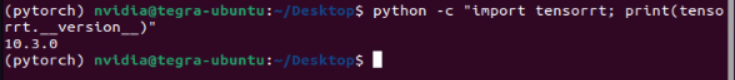

# NVIDIA Jetson Orin Nano环境配置教程(jetpack6.2)

## 第一步：安装jetpack环境

打开jtop查看INFO，观察有没有安装**CUDA，cuDNN，TensorRT**



如果没有安装则执行：

```bash
sudo apt install nvidia-jetpack
```

运行后会安装大约4GB的内容，安装完成后，再次打开jtop，就会发现CUDA，cuDNN，TensorRT都已安装。

## 第二步：安装Yolo运行环境

首先安装**Miniconda3**（这个是Anaconda3的简化版，占用小推荐安装，如果要安装Anaconda3也可以）

执行：

```bash
sh ./Miniconda3-latest-Linux-aarch64.sh
```

这里如果加了**sudo**，则会安装在**root**目录，如果没有加，则安装在**home**目录。如果没有在root用户下运行的需求，则建议安装在home目录。安装过程按照提示来选择就好，建议都yes。

安装完成后，创建新的虚拟环境（xxx为你自己定义的环境名）：

```bash
conda create -n xxx python=3.10
```

创建完成后进入该环境：

```bash
conda activate xxx
```

然后安装ultralytics库

```bash
pip install ultralytics
```

安装完成后，**需要替换numpy，opencv-python，torch，torchvision的版本**

建议先安装**torch，torchvision**

```bash
pip install torch-2.5.0a0+872d972e41.nv24.08-cp310-cp310-linux_aarch64.whl
```

```
pip install torchvision-0.20.0a0+afc54f7-cp310-cp310-linux_aarch64.whl
```

安装完后，需要安装**cuSPARSELt**依赖

```bash
wget https://developer.download.nvidia.com/compute/cuda/repos/ubuntu2204/arm64/cuda-keyring_1.1-1_all.deb
sudo dpkg -i cuda-keyring_1.1-1_all.deb
sudo apt-get update
sudo apt-get -y install libcusparselt0 libcusparselt-dev
```

安装完成后，就可以查看能否正常**import torch**，能够正常import后才能进行后续操作，出现下图说明成功



能够正常import后，拷贝TensorRT库到自己的虚拟环境：

```bash
cp -r /usr/lib/python3.10/dist-packages/tensorrt ~/anaconda3/envs/myenv/lib/python3.10/site-packages/
```

注：TensorRT 通常由 JetPack 安装在 `/usr/lib/python3.10/dist-packages/tensorrt` 目录下

拷贝完成后，在自己的虚拟环境中：

```bash
python -c "import tensorrt; print(tensorrt.__version__)"
```

成功显示如下图



替换**opencv-python**版本：

```bash
pip install opencv-python==4.6.0.66
```

如果没有则安装4.6系列其他版本

替换**numpy**版本：

```bash
pip install "numpy<2"
```

安装**onnxslim，onnxruntime_gpu**

```bash
pip install onnxslim
```

```bash
pip install onnxruntime_gpu-1.23.0-cp310-cp310-linux_aarch64.whl
```


**注：requirement_pack中提供部分包，可以直接传到板端使用**

requirement_pack的下载链接：

```
链接：https://pan.baidu.com/s/1Yl6hs4zOaOpHeM80IU-kmA 
提取码：1234 
--来自百度网盘超级会员V4的分享
```


## 至此，推理Yolo的环境搭建完成，可以进行engine模型的转换与推理
